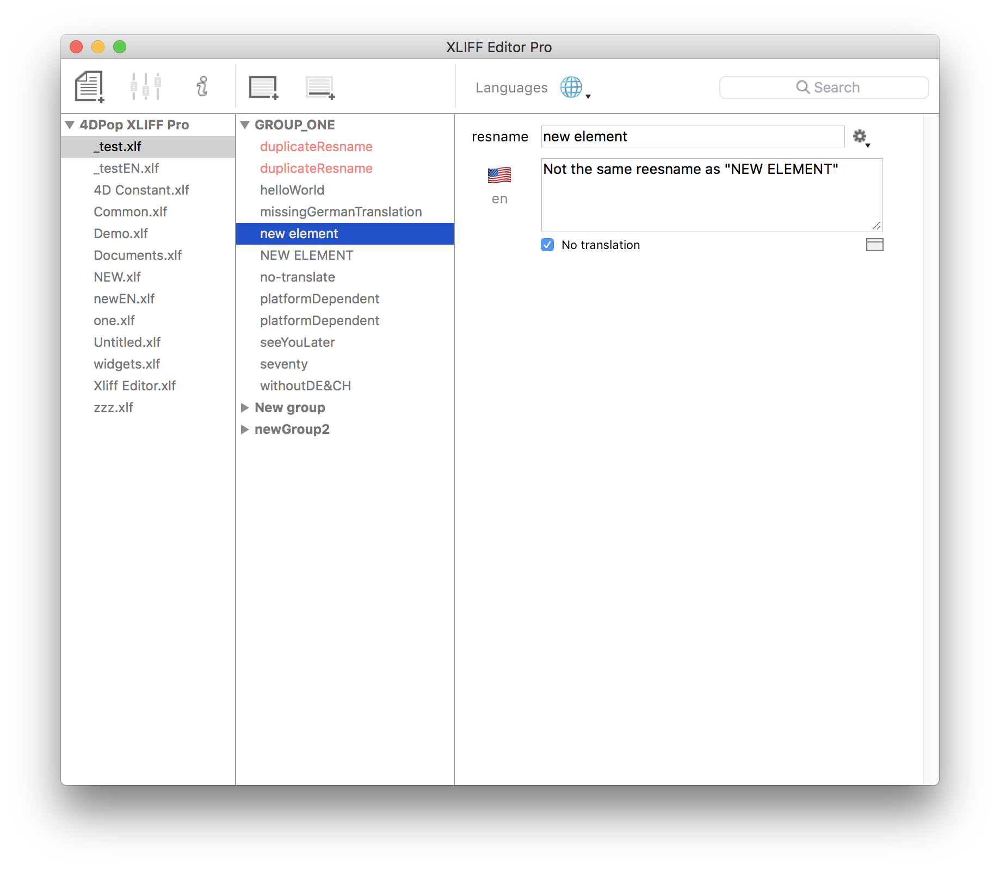

# 4DPop XLIFF Pro

4DPop XLIFF Pro makes it clean and simple to edit XLIFF files and so localize your project.

No need to read the specification or be an XML expert, everything is done automatically for you, just stay focused on the texts you want to localize.

## Multi Languages

* Define the reference language then add as many languages as you want, files and folder are automatically created/updated.

* Manage all standards ie. Language-Regional Codes, ISO639-1 and Legacy names.

* When a localization isn't done, the file is updated with the source string as target string  (so **all localized files are always synchronized**).

* Automatically update the "state" attribute for the "target" string ("new", "need translation") according to the XLIFF specification, so that the created files can be edited with another XLIFF editor.

* In the editor, the not translated strings are highlighted depending the translate status (solarized light background).

## Duplicate resnames

* **Detecting the uniqueness of resname into a file** with auto-expanding & highlighting of duplicated items.
* The "resname" is case-sensitive, so the same resname but with a case difference is not considered duplicated.
* A "resname" is also not considered duplicated if it is loaded only on a platform.

## Notes & platform

* **Note management**

* **Platform Management**. Allows you to load a different string depending on the platform.

## Working language

* **Filter the working language** - Keep only at screen the reference and one localization language, all other languages continue to be synchronized.

## Action menu

* Auto formatting of the resname according to the source string.
* Choosing platform.
* Set reference value to all languages.

            

## Miscellaneous

* **Automatic ID** to ensure uniqueness in the file.
* **Backup in real time**. A modification is immediatly saved and all the languages are synchronized.
* Keyboard layout & spell check according to each language.
* Import files from another project

## 4D Integration

* Drag and drop a string into the method editor to insert the loading code of the resource, or into the form editor to paste the reference.
